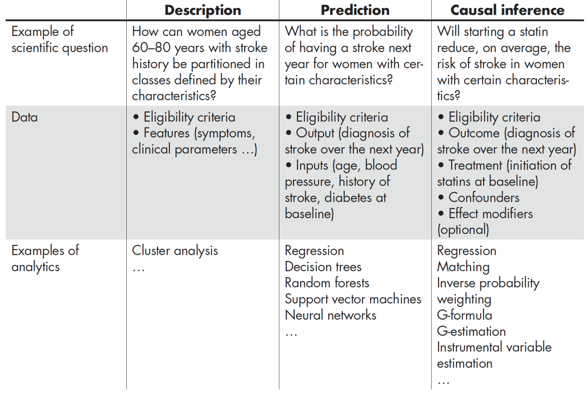
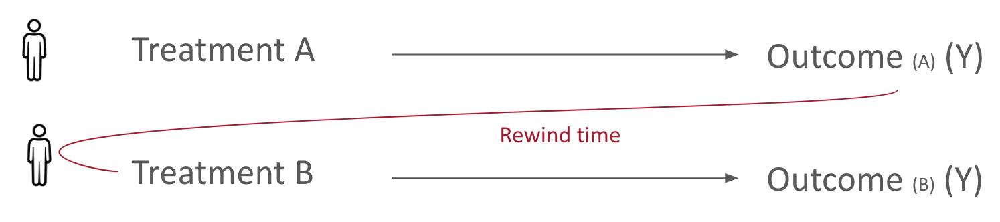
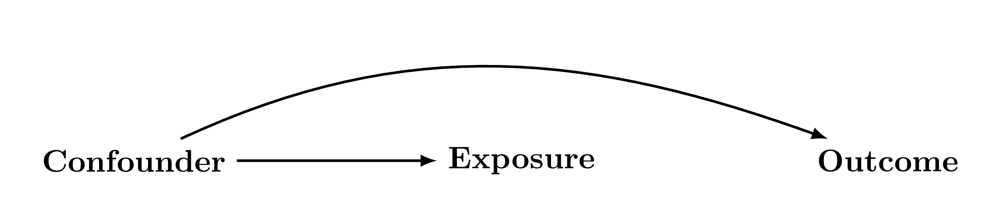
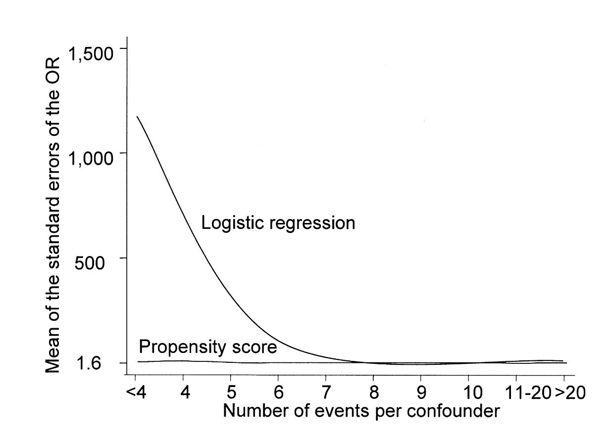
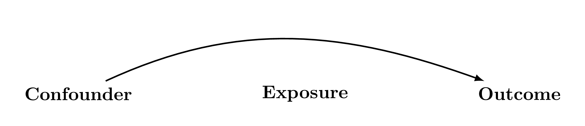

# Preliminaries

```{r}
#| label: setup
#| include: false
load_packages <- function(pkgs) {
  new_pkgs <- pkgs[!pkgs %in% installed.packages()[, "Package"]]
  if (length(new_pkgs)) install.packages(new_pkgs,repos = "https://cloud.r-project.org")
  invisible(lapply(pkgs, library, character.only = TRUE))
}

knitr::opts_chunk$set(cache = TRUE)

```

## Teaching Team Introductions

-   Timothy (Tim) Feeney, Johns Hopkins Bloomberg, USA
-   Catherine (Catie) Wiener, UNC Chapel Hill, USA

## Outline of the workshop

1)  Didactics

-   Background and theory of basic propensity scores
-   Estimands discussion
-   Theory of inverse probability weighting
-   Theory of standard error (SE) estimation

## Outline of the workshop Con't

2)  Practical Activities

:::: {.columns}
::: {.column width="70%"}
-   Breakout sessions to practice and use what we are teaching
-   Will do propensity score analysis, boostrapping, m-estimation
-   Will use R for coding. Please scan the QR code for the website.
:::
::: {.column width="30%"}

:::
::::


## Schedule for the Afternoon

### First half


1:10-1:20 Introduction to Clinical Problem

1:20-1:40 First Activity: Descriptive and Crude Analysis

1:40-2:40 Didactics: Overview of causal, estimands, propensity score basics

2:40-3:10 Second Activity: Estimation of ATE and ATT using IPTW

3:10-3:30 Break


## Schedule for the Afternoon

### Second half

3:30-4:10 Didactics: Standard Error estimation 

4:10-4:50 Third Activity: Using Bootstrap and M-estimation

4:50-5:00 Questions and Closing Remarks

## Acknowledgments

This workshop uses information from the following resources

-   HSPH EPI 271 course materials

-   UNC CH BIOS 776 Causal Notes

-   [What If Casual Textbook](https://miguelhernan.org/whatifbook) by *Hernan and Robins*

-   Manuscripts by [Kurth](https://academic.oup.com/aje/article-abstract/163/3/262/59818?redirectedFrom=fulltext&login=false) *et al.* 2006, [Wiener](https://journals.lww.com/epidem/fulltext/2026/01000/causal_identification_conditions_for_the_effect_of.9.aspx) *et al* 2025, [Sato and Matsuyama](https://journals.lww.com/epidem/Fulltext/2003/11000/Marginal_Structural_Models_as_a_Tool_for.9.aspx) 2003 and [Ross](https://academic.oup.com/ije/article/53/2/dyae030/7616672?login=false) *et al.* 2023

-   [Essential Statistical Inference](https://link.springer.com/book/10.1007/978-1-4614-4818-1) by *Stefanski and Boos*

##  {.center}

**What do you want to get out of this course?**

::: notes
We want to know what you want to get out of this course
:::

# Question of Interest and Background

## The Clinical Setup


## The Clinical Setup

-   Tissue plasminogen activatory (t-PA) can breakdown clots and has become a standard of care

-   Kurth *et al.* in 2006 found that the effect of TPA in an observational cohort depends on method of confounding control, and when standardized to the whole sample tPA was harmful.

-   PS distribution also suggested that there specific populations where there might be benefit

## Dataset

Westphalian Stroke Registry of Northwestern Germany (Qualitätssicherung Schlaganfall Nordwestdeutschland, QSNWD)

-   Data obtained from clinical records since 1999

-   Contains information on:

    -   sociodemographics, cerebrovascular factors, comorbidites
    -   details of hospital, admission modality
    -   stroke type and severity, procedures, complications, and status at discharge
    
# *FIRST ACTIVITY*

## FIRST ACTIVITY {.center}

### Descriptive Statistics
### 1:20-1:40

```{r}
#| echo: false
#| results: 'asis'

cat('
<div style="display:flex; flex-direction:column; align-items:center; justify-content:center; height:60vh;">
  <div id="clock" style="font-size: 5rem; font-weight: 300; letter-spacing: 0.05em; font-family: monospace;"></div>
  <div id="date" style="font-size: 1.2rem; color: #888; margin-top: 0.5rem;"></div>
</div>
<script>
function update() {
  const now = new Date();
  const h = String(now.getHours()).padStart(2,"00");
  const m = String(now.getMinutes()).padStart(2,"00");
  const s = String(now.getSeconds()).padStart(2,"00");
  document.getElementById("clock").textContent = h + ":" + m + ":" + s;
  const days = ["Sunday","Monday","Tuesday","Wednesday","Thursday","Friday","Saturday"];
  const months = ["January","February","March","April","May","June","July","August","September","October","November","December"];
  document.getElementById("date").textContent = days[now.getDay()] + ", " + months[now.getMonth()] + " " + now.getDate() + ", " + now.getFullYear();
}
update();
setInterval(update, 1000);
</script>
')
```

# Persuing Causal Estimates

## The question of interest {.center}

What effect does tPA have on in-hospital all-cause mortality?

Is the effect the same in everyone? Is it the same in the whole population?

## Approaches to finding an answer

::: {style="text-align: center;"}
{width="80%"}
:::

::: footer
Hernán et al. (2019) A Second Chance to Get Causal Inference Right *Chance*
:::

## Learning about causes of effects

Conceptualize with Potential Outcomes

-   if we gave a person tPA and observed their outcome

-   if instead we witheld tPA and observed the outcome

Would the outcomes be the same?

{.absolute top=-10 right=-10 width="150px"}





## Learning about causes of effects

-   This is the idea behind the potential outcome/counterfactual framework

-   Let $i$ index a person 

-   Let $A_i$ and $Y_i$ be RVs for treatment and the outcome for $i$th person

-   $Y_i^{A=a}$ is the outcome had treatment $A=a$ in person $i$

-   E.g., comparisons of interest are $Y_i^{a=\text{tPA}}-Y_i^{a=\text{no tPA}}$ $\forall i$

-   in words: what would the individual effect be had each patient $i$ recieved tPA versus not

## Learning about causes of effects

-   we cannot learn about individual effects;

    -   we only have $Y_i^{a=\text{tPA}}$ OR $Y_i^{a=\text{no tPA}}$ for each $i$
    -   no time machine or TARDIS

-   Thus we calculate $\textrm{E}\left[Y_i^{a=\text{tPA}}-Y_i^{a=\text{no tPA}}\right]$,  average treatment effect (ATE)

-   The average effect had everyone gotten treatment, tPA, versus had everyone received no treatment, no tPA.

- foreshadowing: there are alternative treatment effects that may of interest

## Estimating the Average Treatment Effect

Two ways to approach this:

|   | Benefits | Problems |
|-----------------|:------------------------|:-----------------------------|
| Randomized Trials | Balanced groups in expectation | Perhaps infeasible, non generalizable |
| Observational Studies | Generalizable, potentially more feasible | Confounding, *et al* |

We will focus on Observational Studies here

## Causal Identification Conditions {auto-animate="true"}

::: {style="margin-top: 100px;"}
Conditional Exchangeability: $Y^{a=1}, Y^{a=0}\perp\!\!\!\perp A| L$
:::

Consistency: $Y=Y^{a=1}A+Y^{a=0}(1-A)$

Positivity: $P[A=a|\mathbf{L}]>0 \ \forall \ l$ where $f(l)>0$

## A major concern of non-randomized studies {auto-animate="true"}

::: {style="margin-top: 200px; font-size: 1em; color: red;"}
Conditional Exchangeability: $Y^{a=1}, Y^{a=0}\perp\!\!\!\perp A| L$
:::

## Confounders are a major concern

Confounder: On a causal path to the outcome AND on a causal path to the exposure AND not caused by the the outcome or exposure.



## Methods to control for confounding

-   Matching

-   Restriction

-   Regression Modeling

-   Weighting

::: {.fragment .fade-up}
These are all amenable to propensity methods
:::

::: {.fragment .fade-up}
We will focus on weighting
:::

# Propensity Scores

## Propensity Score- Definition

The propensity score is the probability of being in a treatment group conditional on covariates--it is the propensity to be treated

$$P[A=1 | \mathbf{L}]$$

where $A$ is treatment level and $\mathbf{L}$ is a vector of covariates.

We will denote propensity score as $\pi(\mathbf{L})$ for simplicity

## Propensity score- Exhangeability

The propensity score is a balancing score[^1].<br>

 If we have a set $\mathbf{L}$ such that $\left(Y^{a=0},Y^{a=1}\right)\perp\!\!\!\perp A \mid \mathbf{L}$ <br> then $\left(Y^{a=0},Y^{a=1}\right)\perp\!\!\!\perp A \mid \pi \left(\mathbf{L}\right)$ <br>

[^1]: Rosenbaum PR, Rubin DB. The Central Role of the Propensity Score in Observational Studies for Causal Effects. Biometrika. 1983

<br>
In other words, if $\mathbf{L}$ represents a vector that contains all variables necessary to achieve exchangeability then the propensity score can provide exchangeability.
<br>
<br>
How do we determine what should be in $\mathbf{L}$?

## Model building and variable selection

Like all causal analysis, variable selection should be principled, guided by your estimand, and driven by your DAG

1)  Identify Variables in your DAG that you believe may be confounders.[^2]

2)  Exclude variables that are
    - a)  mediators of your effect of interest
    - b)  instruments 

[^2]: Brookhart *et al.* Variable Selection for Propensity Score Models. *AJE* 2006

## Propensity Score Estimation

Typically estimate using logistic regression.

<br>

$\text{logit}\left[\widehat{\pi}\left(\mathbf{L}\right)\right]=\text{logit}\left(P\left[A=1 \mid \mathbf{L}\right]\right)=\alpha_0+\boldsymbol{\alpha}^T\mathbf{L}$

and

$\widehat{\pi}\left(\mathbf{L}\right)=\text{expit}\left[\text{logit}\left(P\left[A=1 \mid \mathbf{L}\right]\right)\right]=\text{expit}\left[\alpha_0+\boldsymbol{\alpha}^T\mathbf{L}\right]$

<br>

where $\text{logit}=\text{log}\left(\frac{P\left[A=1 \mid \mathbf{L}\right]}{1-P\left[A=1 \mid \mathbf{L}\right]}\right)$ and $\text{expit}=\left(\frac{1}{1+\exp^{(\alpha_0+\boldsymbol{\alpha}^T\mathbf{L})}} \right)$ 

``` r
#in R
#model the logit of being in treatment
model<-glm(A~L, data=df, family=binomial(link='logit'))

#predict the probability of being in treatment based on covariates
prop_score<-predict(model, type='response')
```

## Advantages

::::: columns
::: {.column width="40%"}
-   Collapses predictors of treatment into a single value.

    -   avoid curse of dimensionality.[^3]

-   Relatively easy to estimate.

-   Multiple uses.
:::

::: {.column width="60%"}

:::
:::::

[^3]: Cepeda *et el.* Comparison of Logistic Regression versus Propensity Score When the Number of Events Is Low and There Are Multiple Confounders. *AJE*. 2003

## Disadvantages

-   Still rely on the assumption that you have all variables necessary to achieve exchangeability.

    -   **There is no magic here, this is not an RCT**

-   People with same propensity score may have different distribution of covariates.

-   Nuisance parameter estimation adds an extra step to estimation.

-   Estimation of standard error may be less straightforward.

## Propensity Score Diagnostics

::::: columns
::: {.column width="30%"}
-Distribution of scores

-Overlap

-Trimming?

-Truncation?
:::

::: {.column width="70%"}

:::
:::::

::: aside
Kurth *et al.* AJE 2006
:::

# Inverse Probability Weighting

## Inverse Probability of Treatment Weights

-   In Epidemiology we are often interested in marginal estimates of effect

-   To achieve this we often use Inverse Probability of Treatment weights (IPTW)

$$\text{IPTW}=W_{IPTW}=\left(f(A\mid\mathbf{L})\right)^{-1}=\frac{1}{P[A\mid\mathbf{L}]}$$

## How IPTW works

{.absolute width="200" left="0"}

{.absolute width="350" right="500" top="50"}

{.absolute width="500" right="5" bottom="0"}

::: aside
Hernan and Robins. *What if* 2020
:::

## How IPTW works

:::::: columns
:::: {.column width="30%"}
**Before**

::: {style="width: 70%; font-size: 0.8em;"}
|       | $A=1$ | $A=0$ |     |
|:------|:------|:------|:----|
| $L=0$ | 4     | 4     |     |
| $L=1$ | 9     | 3     |     |
| Total | 13    | 7     | 20  |
:::
::::

::: {.column width="70%"}
:::
::::::

{.absolute width="1000" right="50" bottom="5"}

## How IPTW works

:::::::: columns
:::: {.column width="30%"}
**Before**

::: {style="width: 70%; font-size: 0.8em;"}
|       | $A=1$ | $A=0$ |     |
|:------|:------|:------|:----|
| $L=0$ | 4     | 4     |     |
| $L=1$ | 9     | 3     |     |
| Total | 13    | 7     | 20  |
:::
::::

::: {.column width="20%"}
:::

:::: {.column width="30%"}
**After**

::: {style="width: 70%; font-size: 0.8em;"}
|       | $A=1$ | $A=0$ |     |
|:------|:------|:------|:----|
| $L=0$ | 8     | 8     |     |
| $L=1$ | 12    | 12    |     |
| Total | 20    | 20    | 40  |
:::
::::
::::::::

{.absolute width="1000" right="50" bottom="5"}

## Stabilized Versus Unstabilized

$$\widehat{\mathrm{W}}_{US,i}=\frac{1}{f(A|\mathbf{L})}=\frac{1}{P[A|\mathbf{L}]}$$

Stabilized weights are scaled by the probability of treatment.

$$\widehat{\mathrm{W}}_{S,i}=\frac{f(A)}{f(A|\mathbf{L})}=\frac{P[A]}{P[A|\mathbf{L}]}$$

## Stabilized Versus Unstabilized

{.absolute width="530" left="0" top="150"}

{.absolute width="530" right="0" top="150"}

::: aside
Hernan and Robins *What if* 2020
:::

# Estimation Examples

## Example ATE estimation - Setup

What is the ATE of quitting smoking versus not on weight change between 1971 and 1982? 

Using NHEFS Data from Hernan and Robins

Treatment of interest: Quitting smoking (qsmk) Confounders: Sex, Age, Race

## Description of NHEFS data

```{r}
set.seed(12345) #set seed for todays

load_packages(c("causaldata","dplyr"))
ex<-causaldata::nhefs %>%
   select(wt82_71, qsmk, age, race, sex) %>%
    filter(!is.na(wt82_71)) %>%
    head()
ex
```

## Estimating the ATE, Horvitz Thompson Estimator

$$\frac{1}{n}\sum_i \hat{\mathrm{W}}_iY_iA_i-\frac{1}{n}\sum_i \hat{\mathrm{W}}_iY_i(1-A_i) $$

## Estimating the ATE, Horvitz Thompson Estimator Setup

```{r}
nhefs<-causaldata::nhefs %>% filter(!is.na(wt82_71))
# Model treatment
trt_model<-glm(qsmk ~ as.factor(sex) + as.factor(race) + age + I(age^2),
 data=nhefs,
 family=binomial())
# Estimate propensity score
nhefs$prop_score<-ifelse(nhefs$qsmk==1,
 predict(trt_model, type="response"),
 1-predict(trt_model, type="response"))
# Estimate unstabilized IPTW
nhefs$w<-1/nhefs$prop_score
```

```{r}
#| echo: FALSE
nhefs %>% select(wt82_71, qsmk, age, race, sex, prop_score, w) %>% head(n=4)
```

## Estimating the ATE, Horvitz Thompson Estimator Code

$$\frac{1}{n}\sum_i \hat{\mathrm{W}}_iY_iA_i-\frac{1}{n}\sum_i \hat{\mathrm{W}}_iY_i(1-A_i) $$

```{r}
#| echo: FALSE
nhefs<-causaldata::nhefs %>% filter(!is.na(wt82_71))
# Model treatment
trt_model<-glm(qsmk ~ as.factor(sex) + as.factor(race) + age + I(age^2), data=nhefs, 
                  family=binomial())
# Estimate propensity score
nhefs$prop_score<-ifelse(nhefs$qsmk==1, predict(trt_model, type="response"),
 1-predict(trt_model, type="response"))
# Estimate unstabilized IPTW
nhefs$w<-1/nhefs$prop_score
```

```{r}
nhefs$treat<-nhefs$w*nhefs$wt82_71*nhefs$qsmk
nhefs$untrt<-nhefs$w*nhefs$wt82_71*(1-nhefs$qsmk)
ate<-mean(nhefs$treat, na.rm=T)-mean(nhefs$untrt, na.rm=T)
ate
```

## Example ATE, Hajek Estimator

We may instead want to use regression using least squares

If instead of minimizing $\sum_i \left[Y_i-(\widehat{\alpha_0} + \widehat{\alpha_1} A_i)\right]^2$ 

we minimize $$\sum_i \widehat{\mathrm{W}_i}\left[Y_i-(\widehat{\alpha_0} + \widehat{\alpha_1} A_i)\right]^2$$

This is equivalent to using the Hajek estimator

$$\widehat{\alpha}_1=\frac{\sum_i \widehat{W_i} Y_i A_i}{\sum_i \widehat{W_i} A_i}-\frac{\sum_i \widehat{W_i} Y_i\left(1-A_i\right)}{\sum_i \widehat{W_i}\left(1-A_i\right)} $$

## Estimating the ATE, Hajek Estimator Code

$$\frac{\sum_i \widehat{W}_i Y_i A_i}{\sum_i \widehat{W}_i A_i}-\frac{\sum_i \widehat{W}_i Y_i\left(1-A_i\right)}{\sum_i \widehat{W}_i\left(1-A_i\right)} $$

```{r}
#| echo: FALSE
nhefs<-causaldata::nhefs %>% filter(!is.na(wt82_71))
# Model treatment
trt_model<-glm(qsmk ~ as.factor(sex) + as.factor(race) + age + I(age^2), data=nhefs, 
                  family=binomial())
# Estimate propensity score
nhefs$prop_score<-ifelse(nhefs$qsmk==1, predict(trt_model, type="response"),
 1-predict(trt_model, type="response"))
# Estimate unstabilized IPTW
nhefs$w<-1/nhefs$prop_score
nhefs$treat<-nhefs$w*nhefs$wt82_71*nhefs$qsmk
nhefs$untrt<-nhefs$w*nhefs$wt82_71*(1-nhefs$qsmk)
ate<-mean(nhefs$treat, na.rm=T)-mean(nhefs$untrt, na.rm=T)
```

```{r}
# weighting the regression model
Y_model_ate<-lm(wt82_71~qsmk, weights=w, data=nhefs)
```

```{r echo=FALSE}
# Horvitz Thompson ATE
paste0("ATE estimate using Hortvitz Thompson: ",round(ate,4))

# regression based ATE (Hajek estimator)
paste0("ATE estimate using Hajek: ",round(Y_model_ate$coefficients[2],4))
```

## Advantages of using Propensity Score Weights

-   Can be used in many scenarios to obtain marginal estimates
    -   Average Treatment Effect [^4] -IPTW, we did this above
    -   Average Treatment Effect among Treated (ATT)/ Untreated (ATU) [^5] - SMR/SRR, next
-   Uses all the data

[^4]: Hernan *et al.* What if 2020

[^5]: Sato and Matsuyama *Epidemiology* 2003

## The question of interest {.center}

What effect does tPA have on in-hospital all-cause mortality?

::: {.fragment .fade-up}
Is the ATE what we are interested in?

Do we expect that everyone coming into an ED with stroke symptoms would benefit from tPA?
:::

::: {.fragment .fade-up}
What if were were interested in the effect of giving everyone treatment versus not 
:::

::: {.fragment .fade-up}
- *only* in those that had been treated?
:::

::: {.fragment .fade-up}
- *only* in those that had been untreated?
:::

## ATT

$$E\left[Y^{a=1}-Y^{a=0}\Big| \, A=1\right]$$

Average Effect among those that were treated.

Can be obtained using Standardized Mortality Ratio (SMR) weights[^6]

[^6]: Sato and Matsuyama *Epidemiology* 2003

*Why might this be more pertinent for our question about stroke treatment?*

## Estimating the ATT {auto-animate="true"}

Under a slightly different set of identification conditions:

Consistency: $Y=Y^{a=1}A+Y^{a=0}(1-A)$

::: {style="margin-top: 100px;"}
Positivity: $P[A=a|\mathbf{L}]>0 \ \forall \ l$ where $f(l|a=1)>0$
:::

::: {style="margin-top: 100px;"}
Conditional Exchangeability: $Y^{a=0}\perp\!\!\!\perp A| L$
:::

## Estimating the ATT {auto-animate="true"}

::: {style="margin-top: 200px; font-size: 1em; color: red;"}
Positivity: $P[A=a|\mathbf{L}]>0 \ \forall \ l$ where $f(l|a=1)>0$
:::

::: {style="margin-middle: 200px; font-size: 1em; color: red;"}
Conditional Exchangeability: $Y^{a=0}\perp\!\!\!\perp A| L$
:::

## Estimating SMR weights for the ATT

Weights to make the untreated look like the treated

$$
\widehat{W_{i}}_{SMR}=\frac{P\left[A=1 \mid \mathbf{L}\right]}{P\left[A=a \mid \mathbf{L}\right]} \implies 
\widehat{W_{i}}_{SMR}=
\begin{cases}
    a=1,&    1 \\
    a=0,& \frac{\widehat{\pi}(\mathbf{L})}{1-\widehat{\pi}(\mathbf{L})}
\end{cases}
$$

``` {.r code-line-numbers="6-7"}
nhefs<-causaldata::nhefs
# Model treatment
trt_model<-glm(qsmk ~ as.factor(sex) + as.factor(race) + age + I(age^2), data=nhefs, 
                  family=binomial())
# Estimate propensity score
nhefs$prop_score<-ifelse(nhefs$qsmk==1, 1,
 predict(trt_model, type="response")/(1-predict(trt_model, type="response")))
 nhefs$w_att<-1/nhefs$prop_score
```

```{r}
#| echo: FALSE
nhefs<-causaldata::nhefs%>% filter(!is.na(wt82_71))
# Treatment model
trt_model<-glm(qsmk ~ as.factor(sex) + as.factor(race) + age + I(age^2), data=nhefs, family=binomial())
# Estimate propensity score
nhefs$prop_score<-ifelse(nhefs$qsmk==1, 1,
 predict(trt_model, type="response")/(1-predict(trt_model, type="response")))
nhefs$w_att<-nhefs$prop_score
```

```{r}
#| echo: FALSE
# weighting the regression model
Y_model_att<-lm(wt82_71~qsmk, weights=w_att, data=nhefs)
# regression based ATT
att<-Y_model_att$coefficients[2]
paste0("The estimated ATT is: ", round(att,2))
```

## ATU

$$E\left[Y^{a=1}-Y^{a=0}\Big|\, A=0\right]$$

Average Effect among those that were untreated.

Can be obtained using Standardized Risk/Rate Ratio (SRR) weights[^7]

[^7]: Sato and Matsuyama *Epidemiology* 2003

*Why might this not be as interesting for our question about stroke treatment?*

## Estimating the ATU {auto-animate="true"}

Under a slightly different set of identification conditions:

Consistency: $Y=Y^{a=1}A+Y^{a=0}(1-A)$

::: {style="margin-top: 100px;"}
Positivity: $P[A=a|\mathbf{L}]>0 \ \forall \ l$ where $f(l|a=0)>0$
:::

::: {style="margin-top: 100px;"}
Conditional Exchangeability: $Y^{a=1}\perp\!\!\!\perp A| L$
:::

## Estimating the ATU {auto-animate="true"}

::: {style="margin-top: 200px; font-size: 1em; color: red;"}
Positivity: $P[A=a|\mathbf{L}]>0 \ \forall \ l$ where $f(l|a=0)>0$
:::

::: {style="margin-middle: 200px; font-size: 1em; color: red;"}
Conditional Exchangeability: $Y^{a=1}\perp\!\!\!\perp A| L$
:::

## Estimating SRR Weights for the ATU

New weights to make the treated look like the untreated, thereby standing in for them.

$$
\widehat{W_i}_{SRR}=\frac{P\left[A=0 \mid \mathbf{L}\right]}{P\left[A=a \mid \mathbf{L}\right]} \implies 
\widehat{W_i}_{SRR}= 
\begin{cases}
    a=1,&    \frac{1-\widehat{\pi}(\mathbf{L})}{\widehat{\pi}(\mathbf{L})} \\
    a=0,& 1
\end{cases}
$$

``` {.r code-line-numbers="6-7"}
nhefs<-causaldata::nhefs
# Model treatment
trt_model<-glm(qsmk ~ as.factor(sex) + as.factor(race) + age + I(age^2), data=nhefs, 
                  family=binomial())
# Estimate propensity score
nhefs$prop_score<-ifelse(nhefs$qsmk==0, 1,
 (1-predict(trt_model, type="response"))/predict(trt_model, type="response"))
 nhefs$w_atu<-1/nhefs$prop_score
```

```{r}
#| echo: FALSE
nhefs<-causaldata::nhefs %>% filter(!is.na(wt82_71))
# Treatment Model
trt_model<-glm(qsmk ~ as.factor(sex) + as.factor(race) + age + I(age^2), data=nhefs,family=binomial())
# Estimate propensity score
nhefs$prop_score<-ifelse(nhefs$qsmk==0, 1,
 (1-predict(trt_model, type="response"))/predict(trt_model, type="response"))
nhefs$w_atu<-nhefs$prop_score
```

```{r}
#| echo: FALSE
# weighting the regression model
Y_model_atu<-lm(wt82_71~qsmk, weights=w_atu, data=nhefs)
# regression based ATT
atu<-Y_model_atu$coefficients[2]
paste0("The estimated ATU is: ", round(atu,2))
```

# *SECOND ACTIVITY*

## SECOND ACTIVITY {.center}

Estimate the ATE, ATT, and ATU using IPTW in the tPA data

1)  Explain in words what each estimand means in this context, and which estimand you think has meaning for our question of interest.

2)  Estimate the ATE, ATT, and ATU in the data.

### 2:40-3:10
### 3:10-3:30 Break

```{r}
#| echo: false

htmltools::browsable(
  htmltools::HTML('
<div style="display:flex; flex-direction:column; align-items:center; justify-content:center; margin-top: 1rem;">
  <div id="clock3" style="font-size: 4rem; font-weight: 300; letter-spacing: 0.05em; font-family: monospace;"></div>
  <div id="date3" style="font-size: 1rem; color: #888; margin-top: 0.5rem;"></div>
</div>
<script>
function updateClock3() {
  const now = new Date();
  const h = String(now.getHours()).padStart(2,"0");
  const m = String(now.getMinutes()).padStart(2,"0");
  const s = String(now.getSeconds()).padStart(2,"0");
  document.getElementById("clock3").textContent = h + ":" + m + ":" + s;
  const days = ["Sunday","Monday","Tuesday","Wednesday","Thursday","Friday","Saturday"];
  const months = ["January","February","March","April","May","June","July","August","September","October","November","December"];
  document.getElementById("date3").textContent = days[now.getDay()] + ", " + months[now.getMonth()] + " " + now.getDate() + ", " + now.getFullYear();
}
updateClock3();
setInterval(updateClock3, 1000);
</script>
  ')
)
```

# Standard Errors

## Standard Error Estimation:

-   Until now we have discussed effect estimation but have not talked about Standard Error (SE) estimation.

-   This is more complicated

    -   Multiple estimation steps need to be accounted for

    -   No closed form solution for this

    -   Need alternative methods
    
## Robust Variance Estimation

- Commonly cited method of obtaining SE estimates, referred to a 'Huber-White' SEs

- The Sandwich Variance Estimator

$$\hat{V}=(-A)^{-1}B(-A)^{-1}$$
  
- **Assumes weights are known.**

- Conservative in estimating ATE, Conservative or Anticonservative for the ATT[^8]

[^8]: Reifeis and Hudgens *AJE* 2022

## Robust Variance Estimation

R-Code
``` {.r}
load_packages(c("sandwich"))
sandwich:::sandwich(Y_model_att)
```
or
```{.r}
load_packages(c("geepack"))
summary(geeglm(wt82_71~qsmk, weights=w_att, data=nhefs, id=seqn))
```

### Standard Errors By Method

| Method | ATE | ATT | ATU |
| --------- | --------- | --------- | --------- |
| Model  | `r round(broom::tidy(Y_model_ate)[2,3],3)`   | `r round(broom::tidy(Y_model_att)[2,3],3)`   | `r round(broom::tidy(Y_model_atu)[2,3],3)` |
| Robust   | `r round(sqrt(sandwich::sandwich(Y_model_ate)[2,2]),3)`  | `r round(sqrt(sandwich::sandwich(Y_model_att)[2,2]),3)`   | `r round(sqrt(sandwich::sandwich(Y_model_atu)[2,2]),3)` 


## Standard Error Estimation-Bootstrapping

1)  From a sample of $1 \ldots N$ individuals, sample a total of N individuals with replacement, resulting in new sample of size $K$, where $K=N$

2)  Perform estimation on new sample of $1 \ldots K$ individuals

3)  Repeat this process $j$ times; $j \geq 200-300$ but ideally many more (e.g., 3000-5000). Also worry about machine error with low numbers [^9].

[^9]:Morris TP *et al.* Using simulation studies to evaluate statistical methods. Stats in Med. 2019.


## Standard Error Estimation-Bootstrapping Cont.

4)  Use the standard error or percentile cut-offs from the distribution of estimates to estimate the empirical standard error.

5)  Use this empirical standard error to calculate Wald confidence intervals.

## Standard Error Estimation-Bootstrapping

```{r}
#| echo: FALSE
#| message: FALSE 
nhefs<-causaldata::nhefs %>% filter(!is.na(wt82_71))
boot<-function(data, nsims, estimand=NULL){
    effects<-vector()
    mean_diffs<-vector()
    for (i in 1:nsims){
        #random sample from data with size=n, and replacement (ie bootstrap sampling)
        samp<-sample_n(data,
                       size=nrow(data),
                       replace = TRUE) 
        #calculate robability of treatment, ABC/3TC in this sample
        # Treatment Model
        trt_model<-glm(qsmk ~ as.factor(sex) + as.factor(race) + age + I(age^2), data=samp,family=binomial())
       ps <- predict(trt_model, type = "response")
    
    # Compute propensity scores and weights based on estimand
    if (estimand == "ATE") {
      samp$prop_score <- ifelse(samp$qsmk == 1, ps, 1 - ps)
      samp$w <- 1 / samp$prop_score
      
    } else if (estimand == "ATT") {
      samp$prop_score <- ifelse(samp$qsmk == 1, 1, ps / (1 - ps))
      samp$w <- samp$prop_score
      
    } else if (estimand == "ATU") {
      samp$prop_score <- ifelse(samp$qsmk==0, 1, (1 - ps) / ps)
      samp$w<-samp$prop_score
    
    } else {
      stop("Invalid estimand. Need to specify appropriate estimand")
    }
  
        # weighting the regression model
        Y_model<-lm(wt82_71~qsmk, weights=w, data=samp)
        # regression based ATT
        effect<-Y_model$coefficients[2]
      
        effects<-append(effects, effect)
    }
    return(effects)
}
```

From Bootstrapping:
```{r}
atu_boot<-boot(nhefs,5000, estimand="ATU")
```

```{r}
#| echo: FALSE
# View bootstrap estimates
atu_boot_se<-sqrt(var(atu_boot))
atu_boot_estimate<-mean(atu_boot)
paste0("The bootstrap ATU estimate is: ",round(atu_boot_estimate,3));paste0("The ATU Bootstrap SE is: ", round(atu_boot_se, 3))
```

```{r}
#| echo: FALSE
nhefs<-causaldata::nhefs %>% filter(!is.na(wt82_71))
# Treatment Model
trt_model<-glm(qsmk ~ as.factor(sex) + as.factor(race) + age + I(age^2), data=nhefs,family=binomial())
# Estimate propensity score
nhefs$prop_score<-ifelse(nhefs$qsmk==0, 1,
 (1-predict(trt_model, type="response"))/predict(trt_model, type="response"))
 nhefs$w_atu<-nhefs$prop_score
# weighting the regression model
Y_model<-lm(wt82_71~qsmk, weights=w_atu, data=nhefs)
# regression based ATT
atu<-Y_model$coefficients[2]
```

From estimation above
```{r}
#| echo: FALSE
paste0("The estimated ATU is: ", round(atu,2))
```

```{r}
#| echo: false
att_boot<-boot(nhefs,5000, estimand="ATT")
ate_boot<-boot(nhefs,5000, estimand="ATE")
att_se<-sqrt(var(att_boot)); ate_se<-sqrt(var(ate_boot))
```
## Standard Error Estimation-Bootstrapping Problems:

- Time
```{.r}
> system.time(atu_boot<-boot(nhefs,100, estimand= "ATU"))
   user  system elapsed 
  0.250   0.022   0.273 
> system.time(atu_boot<-boot(nhefs,1000, estimand= "ATU"))
   user  system elapsed 
  2.675   0.242   2.917 
> system.time(atu_boot<-boot(nhefs,10000, estimand= "ATU"))
   user  system elapsed 
  26.91    2.44   29.52 
```


## Variance Estimation--Updated

### Standard Errors By Method

| Method | ATE | ATT | ATU |
| --------- | --------- | --------- | --------- |
| Model  | `r round(broom::tidy(Y_model_ate)[2,3],3)`   | `r round(broom::tidy(Y_model_att)[2,3],3)`   | `r round(broom::tidy(Y_model_atu)[2,3],3)` |
| Robust   | `r round(sqrt(sandwich::sandwich(Y_model_ate)[2,2]),3)`  | `r round(sqrt(sandwich::sandwich(Y_model_att)[2,2]),3)`   | `r round(sqrt(sandwich::sandwich(Y_model_atu)[2,2]),3)` |
| Bootstrap   | `r round(ate_se, 3)`  | `r round(att_se, 3)`  | `r round(sqrt(var(atu_boot)), 3)` |

## M-Estimation

### NB: There is no way to cover all of M-Estimation in the remainder of this session but we will hopefully cover aspects for you to make use of it.

## M-Estimation

Excellent sources to dive deeper:

  - Ross *et al.* [M-estimation for common epidemiological  measures: introduction and applied examples](https://academic.oup.com/ije/article/53/2/dyae030/7616672?login=false) IJE 2024
  
  - Boos and Stefanski. [Essential Statistical Inference](https://link.springer.com/book/10.1007/978-1-4614-4818-1) 2013 Ch. 7
  
  -  [An introduction to M-estimation with geex](https://cran.r-project.org/web/packages/geex/vignettes/v00_geex_intro.html)
  
  - ABC's of M-Estimation SER Workshop [ABC's of M-Estimation SER Workshop](https://github.com/pzivich/ABCs_of_M-estimation/)

## M-Estimation

*M-estimation addresses all concerns above.*

- computationally much more efficient

- consistent: estimates close to estimand as $n \rightarrow \infty$

- asymptotically normal estimates: can use SEs in Wald type CIs

- allows you to incorporate prior estimation steps (i.e., estimation of weights)
  - does not require assuming the weights are known as in Sandwich estimator
  
## M-Estimation

M-estimators, $\boldsymbol{\widehat{\theta}}$, are solutions to:

$$\sum_{i=1}^n \psi\left(\boldsymbol{Y}_i, \boldsymbol{\widehat{\theta}}\right)=\mathbf{0} .$$

where $Y_i, \ldots, Y_n$ are observed data and are independent but not necessarily identically distributed

$\boldsymbol{\theta}$ is a $p \times 1$ vector of parameters

$\psi$ is a known $p \times 1$ function not dependent on $n$ or $i$.

## M-Estimation

We can stack estimating functions 

$$
\sum_{i=1}^n\left[\begin{array}{c}
\psi_{\theta_1}\left(Y_i ; \widehat{\theta}\right) \\
\psi_{\theta_2}\left(Y_i ; \widehat{\theta}\right) \\
\vdots \\
\psi_{\theta_k}\left(Y_i ; \widehat{\theta}\right)
\end{array}\right]=\left[\begin{array}{c}
0 \\
0 \\
\vdots \\
0
\end{array}\right]=\mathbf{0}
$$

**The benefit is that during estimation, previous steps can be accounted for.**

## M-Estimation

Recall:
$$
\widehat{\boldsymbol{\theta}} \text { is } \mathrm{AN}\left(\boldsymbol{\theta}_0, \frac{\boldsymbol{V}\left(\boldsymbol{\theta}_0\right)}{n}\right) \text { as } n \rightarrow \infty,
$$
Where an estimator for $\boldsymbol{V}(\boldsymbol{\theta_0})$ is the empirical sandwich variance estimator:

$$
\boldsymbol{V}_n(\boldsymbol{Y}, \widehat{\boldsymbol{\theta}})=\boldsymbol{A}_n(\boldsymbol{Y}, \widehat{\boldsymbol{\theta}})^{-1} \boldsymbol{B}_n(\boldsymbol{Y}, \widehat{\boldsymbol{\theta}})\left\{\boldsymbol{A}_n(\boldsymbol{Y}, \widehat{\boldsymbol{\theta}})^{-1}\right\}^T .
$$

## M-Estimation Variance
A little more on variance estimation

$$
\boldsymbol{V}_n(\boldsymbol{Y}, \widehat{\boldsymbol{\theta}})=\boldsymbol{A}_n(\boldsymbol{Y}, \widehat{\boldsymbol{\theta}})^{-1} \boldsymbol{B}_n(\boldsymbol{Y}, \widehat{\boldsymbol{\theta}})\left\{\boldsymbol{A}_n(\boldsymbol{Y}, \widehat{\boldsymbol{\theta}})^{-1}\right\}^T .
$$
$$
\boldsymbol{A_n(\boldsymbol{Y}, \widehat{\boldsymbol{\theta}})}=\frac{1}{n} \sum_{i=1}^n\left\{-\boldsymbol{\psi}^{\prime}\left(Y_i, \widehat{\boldsymbol{\theta}}\right)\right\}
$$
and 

$$
\boldsymbol{B}_n(\boldsymbol{Y}, \widehat{\boldsymbol{\theta}})=\frac{1}{n} \sum_{i=1}^n \boldsymbol{\psi}\left(Y_i, \widehat{\boldsymbol{\theta}}\right) \boldsymbol{\psi}\left(Y_i, \widehat{\boldsymbol{\theta}}\right)^T
$$

## M-Estimation

This might be overwhelming, so lets work through an example to illustrate this.

{fig-align="center"}

## M-Estimation-Example

Lets estimate the mean and variance using M-Estimation

$$
\widehat{\mu}=\frac{1}{n} \sum_{i=1}^n Y_i
$$
Where $\mu$ is the mean, $\widehat{\mu}$ is an estimator of the mean and $Y_i$ is the $i$th persons outcome

How do we get this into an estimating equation?

Recall, we are trying to get into the form:$\sum_{i=1}^n \psi\left(\boldsymbol{Y}_i, \boldsymbol{\theta}\right)=\mathbf{0}$

## M-Estimation-Example

$$
\begin{aligned}
\widehat{\mu} n & =\sum_{i=1}^n Y_i \\
0 & =\left(\sum_{i=1}^n Y_i\right)-\widehat{\mu} n \\
0 & =\left(\sum_{i=1}^n Y_i\right)-\left(\sum_{i=1}^n \widehat{\mu}\right) \\
0 & =\sum_{i=1}^n\left(Y_i-\widehat{\mu}\right)
\end{aligned}
$$

## M-Estimation-Example

A similar process for variance gives us:

$$
\boldsymbol{\psi}\left(Y_i, \boldsymbol{\theta}\right)=\binom{Y_i-\theta_1}{\left(Y_i-\theta_1\right)^2-\theta_2}
$$

Our Estimating equation is:
$$
\sum_{i=1}^n \boldsymbol{\psi}\left(Y_i, \widehat{\boldsymbol{\theta}}\right)=\binom{\sum_{i=1}^n\left(Y_i-\widehat{\theta}_1\right)}{\sum_{i=1}^n\left((Y_i-\widehat{\theta}_1)^2-\widehat{\theta}_2\right)}=\binom{0}{0}
$$
The M-estimator is $\widehat{\boldsymbol{\theta}}=\left(\bar{Y}, s_n^2\right)^T$ .

## M-Estimation-Example

Now we need to make a computer do this for us.

First Set up the necessary packages and create some example data

```{r}
load_packages(c("numDeriv","rootSolve","geex"))

y <- geexex$Y1  # Data (observations)
n <- length(y)      # Number of observations
```

## M-Estimation-Example

Next set up the equations
```{r}

estimating_function <- function(mu){
  mean = y - mu[1]
  var=(y-mu[1])^2-mu[2]
  return(cbind(mean,var)) 
}

estimating_equation <- function(mu){
  estf = estimating_function(mu)      
  este = colSums(estf)                
  return(este)
}
```


## M-Estimation-Example

Next use root finding to obtain estimates

```{r}
# Root-finding

mu <- rootSolve::multiroot(f = estimating_equation,
                             start = c(0,0)) 
mu_root <- mu$root
```

```{r}
#| echo: FALSE
print(paste("Root finding estimate of mean:", round(mu_root[1],3))) 
```

Compare this to the close form solution using 
```r
sum(y)/n
``` 
in R

```{r}
#| echo: FALSE
print(paste("Closed form estimate of mean:", round(sum(y)/n,3))) 
```


## M-Estimation-Example

Next we need to estimate the variance 

$$\boldsymbol{V}_n(\boldsymbol{Y}, \widehat{\boldsymbol{\theta}})=\boldsymbol{A}_n(\boldsymbol{Y}, \widehat{\boldsymbol{\theta}})^{-1} \boldsymbol{B}_n(\boldsymbol{Y}, \widehat{\boldsymbol{\theta}})\left\{\boldsymbol{A}_n(\boldsymbol{Y}, \widehat{\boldsymbol{\theta}})^{-1}\right\}^T$$
Lets break it down into its components.

$\boldsymbol{A}_n(\boldsymbol{Y}, \widehat{\boldsymbol{\theta}})^{-1}$

$\boldsymbol{B}_n(\boldsymbol{Y}, \widehat{\boldsymbol{\theta}})$

$\left\{\boldsymbol{A}_n(\boldsymbol{Y},\widehat{\boldsymbol{\theta}})^{-1}\right\}^T$

## M-Estimation-Example

Lets start with $$\boldsymbol{A_n(\boldsymbol{Y}, \widehat{\boldsymbol{\theta}})}=\frac{1}{n} \sum_{i=1}^n\left\{-\boldsymbol{\psi}^{\prime}\left(Y_i, \widehat{\boldsymbol{\theta}}\right)\right\}$$

```{r}
deriv <- numDeriv::jacobian(func = estimating_equation,   # Function to find derivative of
                            x = mu_root)                  # Compute Derivative at Root

A <- -1*deriv / n
print(A)
```


## M-Estimation-Example

Next $$\boldsymbol{B}_n(\boldsymbol{Y}, \widehat{\boldsymbol{\theta}})=\frac{1}{n} \sum_{i=1}^n \boldsymbol{\psi}\left(Y_i, \widehat{\boldsymbol{\theta}}\right) \boldsymbol{\psi}\left(Y_i, \widehat{\boldsymbol{\theta}}\right)^T$$

```{r}
outerprod <- t(estimating_function(mu_root)) %*% (estimating_function(mu_root)) # alternative code using matrix algebra

B <- outerprod/n 
print(B)
```

## M-Estimation-Example

combine the components: $$\boldsymbol{V}_n(\boldsymbol{Y}, \widehat{\boldsymbol{\theta}})=\boldsymbol{A}_n(\boldsymbol{Y}, \widehat{\boldsymbol{\theta}})^{-1} \boldsymbol{B}_n(\boldsymbol{Y}, \widehat{\boldsymbol{\theta}})\left\{\boldsymbol{A}_n(\boldsymbol{Y}, \widehat{\boldsymbol{\theta}})^{-1}\right\}^T .$$

```{r}
sandwich <- solve(A) %*% B %*% t(solve(A))
print(sandwich)
```

The sample variance is `r round(sandwich[1,1],4)` 

Closed form using `sum((y-sum(y)/n)^2)/n` $=$ `r  round(sum((y-sum(y)/n)^2)/n,4)`

## M-Estimation-Example

But to get the SE recall 
$$
\widehat{\boldsymbol{\theta}} \text { is } \mathrm{AN}\left(\boldsymbol{\theta}_0, \frac{\boldsymbol{V}\left(\boldsymbol{\theta}_0\right)}{n}\right) \text { as } n \rightarrow \infty,
$$
```{r}
se<-sqrt(diag(sandwich)/n)
print(se)
```

## M-Estimation with geex in R

Setup the function

```{r}
mean_est<-function(data){
     y<-data$Y1
     function(theta){
     c(y - theta[1],          #mean
     (y-theta[1])^2-theta[2]) #var
 }
}
```

## M-Estimation with geex in R

Feed to `geex`

```{r}
results <- m_estimate(
    estFUN = mean_est, 
    data   = geexex,
    root_control = setup_root_control(start = c(1,1)))

print(results@estimates)
print(results@vcov)
print(sqrt(diag(vcov(results))))
```

## M-estimation for IPW ATE and ATT
Build estimating functions for estimating the ATE and ATT.

First, set up functions to estimate the propensity score
<div style="font-size: 60%;">
$$
\psi\left(Y_i, \widehat{\boldsymbol{\theta}}\right)=\left[\begin{array}{c}
A_i-\operatorname{expit}\left(\widehat{\beta}_0+\widehat{\beta}_1 W_i\right) \\
\left(A_i-\operatorname{expit}\left(\widehat{\beta}_0+\widehat{\beta}_1 W_i\right)\right) W_i \\
\end{array}\right]
$$
Where $$\widehat{\pi}_{I P T, i}=\frac{A_i}{\operatorname{expit}\left(\widehat{\beta}_0+\widehat{\beta}_1 W_i\right)}+\frac{1-A_i}{1-\operatorname{expit}\left(\widehat{\beta}_0+\widehat{\beta}_1 W_i\right)}$$ and $$\widehat{\pi}_{S M R, i}=A_i+ \frac{\left(1-A_i\right) * \operatorname{expit}\left(\widehat{\beta}_0+\widehat{\beta}_1 W_i\right)}{1-\operatorname{expit}\left(\widehat{\beta}_0+\widehat{\beta}_1 W_i\right)}$$
</div>


## M-estimation for IPW ATE and ATT

Next setup the function for estimating the weighted control and treatment group means

<div style="font-size: 75%;">
$$
\psi\left(Y_i, \widehat{\boldsymbol{\theta}}\right)=\left[\begin{array}{c}
A_i Y_i \widehat{\pi}_{I P T, i}-\widehat{\theta}_3 \\
\left(1-A_i\right) Y_i \widehat{\pi}_{I P T, i}-\widehat{\theta}_4 \\
A_i \widehat{\pi}_{I P T, i}\left(Y_i-\widehat{\theta}_5\right) \\
\left(1-A_i\right) \widehat{\pi}_{I P T, i}\left(Y_i-\widehat{\theta}_6\right) \\
A_i \widehat{\pi}_{S M R, i}\left(Y_i-\widehat{\theta}_7\right) \\
\left(1-A_i\right) \widehat{\pi}_{S M R, i}\left(Y_i-\widehat{\theta}_8\right) \\
\end{array}\right]
$$
</div>

## M-estimation for IPW ATE and ATT

Last estimate the ATE and ATT
<div style="font-size: 75%;">
$$
\psi\left(Y_i, \widehat{\boldsymbol{\theta}}\right)=\left[\begin{array}{c}
\widehat{\theta}_5-\widehat{\theta}_6-\widehat{\theta}_9\\
\widehat{\theta}_7-\widehat{\theta}_8-\widehat{\theta}_{10}
\end{array}\right]
$$
</div>

## M-estimation for IPW ATE and ATT-Combined


<div style="font-size: 58%;">
$$
\psi\left(Y_i, \widehat{\boldsymbol{\theta}}\right)=\left[\begin{array}{c}
A_i-\operatorname{expit}\left(\widehat{\beta}_0+\widehat{\beta}_1 W_i\right) \\
\left(A_i-\operatorname{expit}\left(\hat{\beta}_0+\widehat{\beta}_1 W_i\right)\right) W_i \\
A_i Y_i \widehat{\pi}_{I P T, i}-\widehat{\theta}_3 \\
\left(1-A_i\right) Y_i \widehat{\pi}_{I P T, i}-\widehat{\theta}_4 \\
A_i \widehat{\pi}_{I P T, i}\left(Y_i-\widehat{\theta}_5\right) \\
\left(1-A_i\right) \widehat{\pi}_{I P T, i}\left(Y_i-\widehat{\theta}_6\right) \\
A_i \widehat{\pi}_{S M R, i}\left(Y_i-\widehat{\theta}_7\right) \\
\left(1-A_i\right) \widehat{\pi}_{S M R, i}\left(Y_i-\widehat{\theta}_8\right) \\
\widehat{\theta}_5-\widehat{\theta}_6-\widehat{\theta}_9\\
\widehat{\theta}_7-\widehat{\theta}_8-\widehat{\theta}_{10}
\end{array}\right]
$$
</div>


## Variance Estimation--Update 2!
```{r}
#| echo: FALSE
## Need to create indicator variables for all multi-level variables
mest_cht <- nhefs |>
  dplyr::mutate(age2=age^2
  ) |> 
  # Selecting exposure, outcome, and all the covariates for the propensity score model
  select(wt82_71, qsmk, age, race, sex, age2) |> filter(!is.na(wt82_71))
```

```{r}
#| echo: FALSE
setup_ef <- function(data) {
  a <- data$qsmk  # Treatment indicator (0/1)
  y <- data$wt82_71  # Outcome variable
  
  # Design matrix for propensity score
  x <- model.matrix(~ ., data = data[, !(names(data) %in% c("qsmk", "wt82_71"))])
  p_ps <- ncol(x)  # Number of propensity score parameters
  
  # Return the estimating function (takes parameter vector theta)
  function(theta) {
    # Split parameter vector into components to keep better track:
    theta_ps <- theta[1:p_ps]                    # Propensity score coefficients
    theta_ipt_mu <- theta[(p_ps + 1):(p_ps + 2)]   # [ipt_mu0, ipt_mu1]
    theta_ipt_delta <- theta[(p_ps + 3)] # [ate]
    theta_smr_mu <- theta[(p_ps + 4):(p_ps + 5)]   # [smr_mu0, smr_mu1]
    theta_smr_delta <- theta[(p_ps + 6)] # [att]
    
    # Propensity score model: logistic regression
    lp <- x %*% theta_ps
    pscore <- plogis(lp)
    D  <- t(x) %*% dlogis(lp)
    V  <- pscore * (1 - pscore)
    ef_ps <- D %*% solve(V) %*% (a - pscore)
    # 
    # # Estimate inverse probability of treatment weights (IPTW)
    ipt <- a / pscore + (1 - a) / (1-pscore)
    smr <- a + (1 - a) * pscore / (1 - pscore)
     
    # # IPT weighted mean estimating functions
     ef_ipt_mu0 <- ((1 - a) * ipt) * (y - theta_ipt_mu[1]) # Control group mean
     ef_ipt_mu1 <- (a * ipt) * (y - theta_ipt_mu[2]) # Treatment group mean
    # 
    # # SMR weighted mean estimating functions
     ef_smr_mu0 <- ((1 - a) * smr) * (y - theta_smr_mu[1]) # Control group mean
     ef_smr_mu1 <- (a * smr) * (y - theta_smr_mu[2]) # Treatment group mean
    # 
    # # Estimating function for the ATE
     ef_ate <-  theta_ipt_mu[2] - theta_ipt_mu[1] - theta_ipt_delta[1]
    # 
    # # Estimating function for the ATT
     ef_att <- theta_smr_mu[2] - theta_smr_mu[1] - theta_smr_delta[1]
    
    # Concatenate results from estimating equations
    # Make sure order aligns with how the thetas are defined
    ef_combined <- c(ef_ps, 
                     ef_ipt_mu0, ef_ipt_mu1,
                     ef_ate,
                     ef_smr_mu0, ef_smr_mu1,
                     ef_att)
    
    return(ef_combined)
  }
}

```

```{r}
#| echo: FALSE
mest_res <- geex::m_estimate(estFUN = setup_ef, 
                 data = mest_cht,
                 root_control = setup_root_control(
                   start = c(rep(0, length(mest_cht)-1 + 6))
                   ),
                 ) 
```


```{r}
#| echo: FALSE
# Indexing out the estimates corresponding to the ATE RD and ATT RD
mest_roots <- geex::roots(mest_res)[c(8,11)]
mest_se <- sqrt(diag(vcov(mest_res)))[c(8,11)]

```


### Standard Errors By Method

| Method | ATE | ATT | ATU |
| --------- | --------- | --------- | --------- |
| Model  | `r round(broom::tidy(Y_model_ate)[2,3],3)`   | `r round(broom::tidy(Y_model_att)[2,3],3)`   | `r round(broom::tidy(Y_model_atu)[2,3],3)` |
| Robust   | `r round(sqrt(sandwich::sandwich(Y_model_ate)[2,2]),3)`  | `r round(sqrt(sandwich::sandwich(Y_model_att)[2,2]),3)`   | `r round(sqrt(sandwich::sandwich(Y_model_atu)[2,2]),3)` |
| Bootstrap   | `r round(ate_se, 3)`  | `r round(att_se, 3)`  | `r round(sqrt(var(atu_boot)), 3)` |
| M-Est   | `r round(mest_se[1], 3)`  | `r round(mest_se[2], 3)`   | -   |

# *THIRD ACTIVITY*

## THIRD ACTIVITY

Estimate SEs using

  - Robust Variance; Boostrap; M-estimation
  
**4:10-4:50**

```{r}
#| echo: false

htmltools::browsable(
  htmltools::HTML('
<div style="display:flex; flex-direction:column; align-items:center; justify-content:center; margin-top: 1rem;">
  <div id="clock3" style="font-size: 4rem; font-weight: 300; letter-spacing: 0.05em; font-family: monospace;"></div>
  <div id="date3" style="font-size: 1rem; color: #888; margin-top: 0.5rem;"></div>
</div>
<script>
function updateClock3() {
  const now = new Date();
  const h = String(now.getHours()).padStart(2,"0");
  const m = String(now.getMinutes()).padStart(2,"0");
  const s = String(now.getSeconds()).padStart(2,"0");
  document.getElementById("clock3").textContent = h + ":" + m + ":" + s;
  const days = ["Sunday","Monday","Tuesday","Wednesday","Thursday","Friday","Saturday"];
  const months = ["January","February","March","April","May","June","July","August","September","October","November","December"];
  document.getElementById("date3").textContent = days[now.getDay()] + ", " + months[now.getMonth()] + " " + now.getDate() + ", " + now.getFullYear();
}
updateClock3();
setInterval(updateClock3, 1000);
</script>
  ')
)
```
  
## Thank you

We appreciate you all for attending

Questions?


